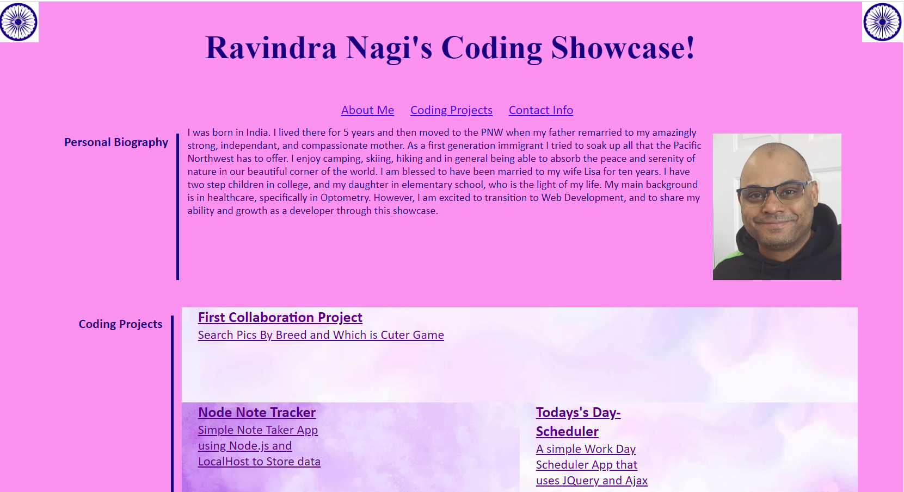

# Portfolio_Showcase

## Table of Contents
* [Description](#description)
* [Install](#install)
* [Contribution](#contribution)
* [Usage](#usage)
* [Testing](#testing)
* [Questions](#questions)
* [License](#license)

## Description
I have created a simple Showcase of my Developer projects using HTML and CSS

## Install
Nothing needed to install. Internet access and a web browser is all that is needed

## Contribution
NaN

## Usage
Public

## Testing
NaN

## Questions
Please reach out to me though my GitHub or via E-mail with any questions or concerns you may have  
rasvindra@hotmail.com  
[github.com/rasvindra](https://github.com/rasvindra)

## License
MIT

https://rasvindra.github.io/Portfolio_Showcase

